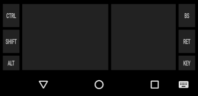
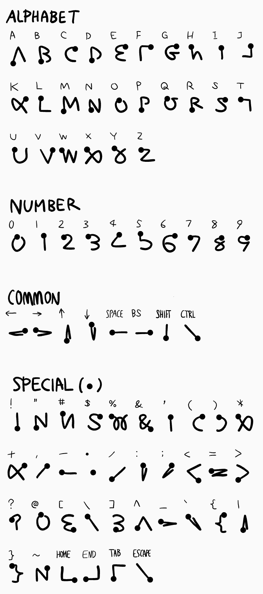

# hackers-unistroke-keyboard

Unistroke Handwriting Input Method for Programming

* Left pane for alphabet.
* Right pane for number.
* Tap enters special key mode.
* KEY button shows some useful key buttons.
* Long press enters cursor mode.

